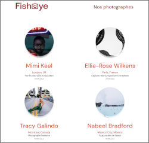

# P6: Design pattern & Accessibility / GameOn website

## Project's presentation

FishEye is a website that allows freelance photographers to showcase their best work. They recently raised funds and would like to update their website from a static website to a dynamic one.

Two imperatives stand out:

* **Factory Method pattern** should be used with JS.

* **Accessibility** - semantic tags, ARIA attributs, alt images, AChecker validators, keyboard navigation.